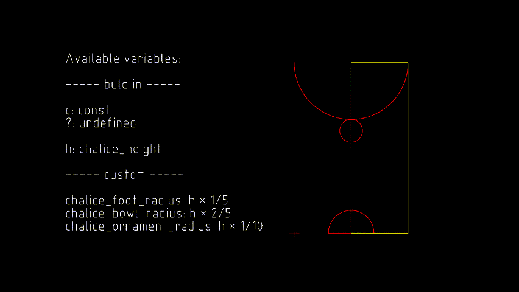

# QSketchMetric

[](https://github.com/MadScrewdriver/qsketchmetric/actions/workflows/tests.yml)
[](https://qsketchmetric.readthedocs.io/en/latest/?badge=latest)
[](https://codecov.io/gh/MadScrewdriver/qsketchmetric)
[](https://opensource.org/licenses/MIT)
[](https://pypi.org/project/qsketchmetric/)
[](https://www.python.org/downloads/release/python-3114/)
[](http://mypy-lang.org/)

**QSketchMetric** is a Python 2D **parametric DXF** rendering engine. Parametrization is done using 
[**QCAD Professional software**](https://qcad.org/en/download)

## ⚡️ Quickstart

```python

from qsketchmetric.renderer import Renderer
from ezdxf import new

output_dxf = new()
input_parametric_dxf_path = 'parametric.dxf'

renderer = Renderer(input_parametric_dxf_path, output_dxf)
renderer.render()

output_dxf.saveas('rendered_parametric.dxf')
```

## 📷 Demo showcase



## ⚙️ Installation

The most common case is the installation by [**pip package manager**](https://pip.pypa.io/en/stable/installation/):

```bash
  pip install qsketchmetric
```

## 🎯 Features

-  Parametric **DXF** rendering
-  Easy dxf files parametrization using [**QCAD Professional software**](https://qcad.org/en/download)
-  Support for `LINE`,`CIRCLE`,`ARC` and `POINT` entities
-  Open source and daily maintained

## 📚 Documentation
Documentation is available at [**QSketchMetric docs**](https://qsketchmetric.readthedocs.io/en/latest/)

## 📈 Roadmap
Support for more entities is planned in the future. If you have any suggestions, please create an issue.
If you want to contribute, see `How to contribute` section in the documentation. I am open to any suggestions
and waiting for your pull requests!

## ⚠️ License
QSketchMetric is licensed under the [**MIT**](https://opensource.org/licenses/MIT) license. 
When using the QSketchMetric in your open-source project I would be grateful for a reference to the repository.
